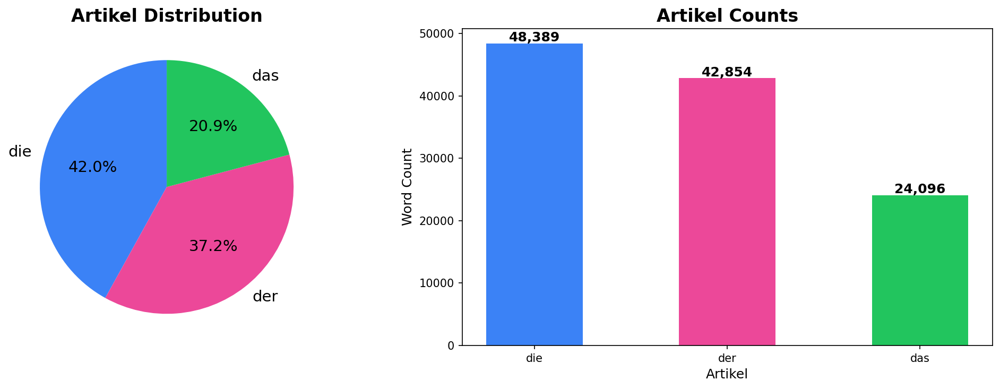
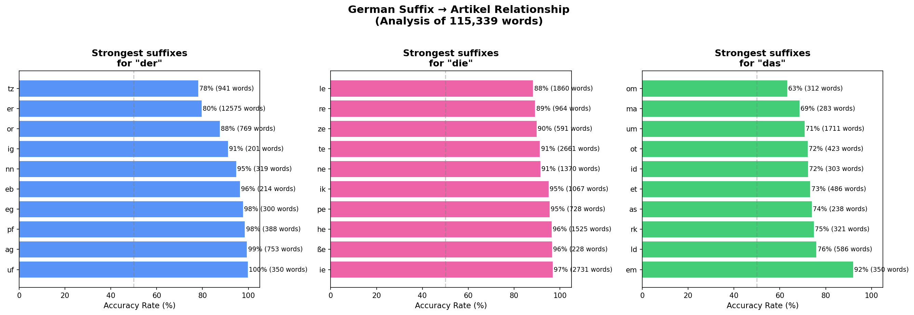
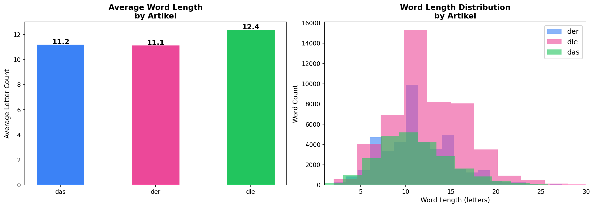

# German Article (Artikel) NLP Analysis 🇩🇪

NLP analysis of 115,339 German nouns to discover patterns between word suffixes and grammatical gender (der/die/das).

## Key Findings

- **die** is the most common artikel (42% of all nouns)
- Words ending in **-ie** are 97% likely to be **die**
- Words ending in **-uf** or **-ag** are 99-100% likely to be **der**
- Words ending in **-em** are 92% likely to be **das**
- **die** words tend to be slightly longer (avg 12.4 letters)

## Visualizations

### Artikel Distribution

### Suffix → Artikel Relationship

### Word Length Analysis

## Dataset
- 115,339 German nouns sourced from Wiktionary
- Each entry contains: word, artikel (der/die/das), plural form, meaning

## Tech Stack
- Python
- Pandas, NumPy
- Matplotlib, Seaborn
- Jupyter Notebook
